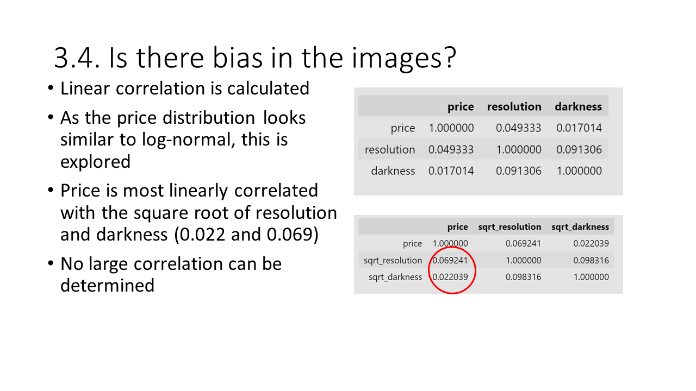

# Bike Price-Prediction

This is a personal project finished as a 2 member group-project for university.

1. Web-Crawling of (bicycle-img, offer-price) mapping, 60000k images
2. Cleanup and analysis
3. "Proof of concept" ResNet50 & Robust Model using MAPE (Mean Absolute Percentage Error)
4. Visualization using GradCam
4. Interested in the tensorflow model? Please contact me :)

Results: From PowerPoint slides, the actuall notebook "BikePricePrediction" is of course more detailed but also contains university requirements (preliminaries etc.):

Below is the full presentation with a high level overview over the project.
- [Table of Content](#my-powerpoint-slides)

  - [1. Problem formulation](#slide-3)
  - [2. Crawling](#slide-5)

  - [3. Filtering and cleaning](#slide-6)
  - [3.1. Filtering out non-bicycle images using ResNet(ImageNet) embeddings](#slide-7)

  - [3.2. Filter out remaining unwated images](#slide-13)

  - [3.3. Remove duplicate images](#slide-18)
  - [3.4. Is there bias?](#slide-19)

  - [3.5. Preprocessing ](#slide-23)
  - [3.5 Mean Image](#slide-24)
  - [3.5 Data Split](#slide-25)
  - [4. Loss Function](#slide-26)

  - [5. Baseline Model](#slide-28)
  - [5. "Finetuned" Model](#slide-29)

  - [5. Robust Model](#slide-32)
  - [5. Recap: "Is there bias in the data?"](#slide-33)
  - [5. GradCam Feature Map visualization](#slide-34)

